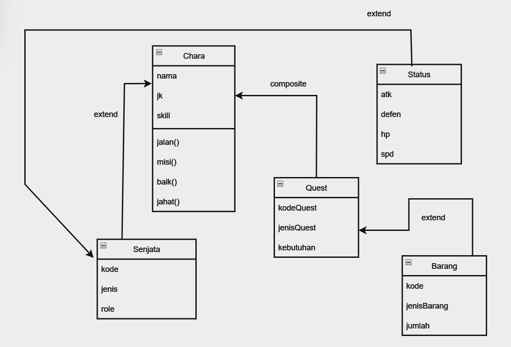

# TP1DPBO2024

# Janji
Saya Raya Cahya NIM 2205714 mengerjakan Tugas Praktikum 1 dalam mata kuliah Desain dan Pemrograman Berorientasi Objek untuk keberkahanNya maka saya tidak melakukan kecurangan seperti yang telah dispesifikasikan. Aamiin.

## Desain Program
Progam ini memiliki 5 class yaitu chara, senjata, status, barang, dan quest. dan class chara memiliki 4 method yaitu :
* jalan
  karakter seolah olah sedang berjalan - jalan
* misi
  karakter seolah olah sedang melakukan misi
* baik
  karakter seolah olah bertemu dengan npc baik
* jahat
  karakter seolah olah bertemu dengan npc jahat

Jadi chara akan menjadi parent bagi senjata dan status, jadi nantinya dalam program akan saya masukkan class status karena sudah mencakup semuanya. lalu class quest merupakan child dari class barang, dan antara class chara dan class barang akan di composite karena chara akan memiliki atribut yang ada di barang.

setelah itu program akan menampilkan status karakter beserta dengan role dan senjata miliknya. dalam kegiatan karakter disana terdapat 4 method yang nantinya akan print keluaran sesuai dengan yang ditentukan

## Alur Program
Alur dari program ini sendiri awalnya membuat sebuah class Chara dengan atribut :

* nama
* jk
Dan class Human ini bisa melakukan :

* jalan
* misi
* baik
* jahat

dan class ini menurunkan 2 anak yaitu class senjata dan status dengan atribut :

senjata
* kode
* jenis
* role
status
* atk
* defen
* hp
* spd

yang nantinya akan di simpan dalam listChara dan listNPC

dan juga terdapat class barang dan memiliki anak class quest dengan atribut :

barang
* kode
* jenisBarang
* jumlah
quest
* kodeQuest
* jenisQuest
* Kebutuhan

yang nantinya akan di simpan dalan listBarang dan listQuest.

## Dokumentasi

